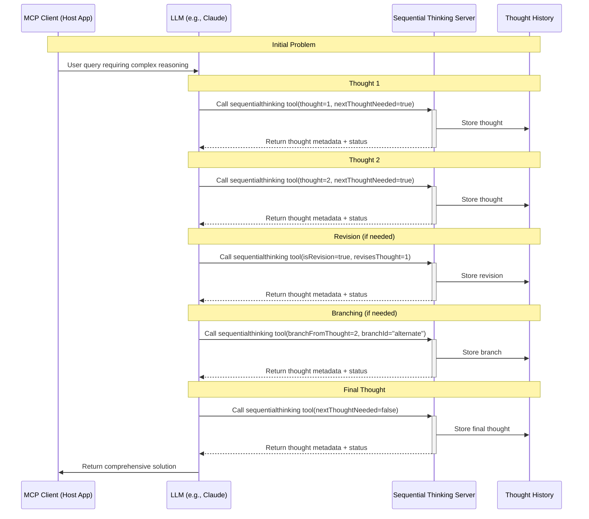

# Sequential Thinking MCP Server Analysis

## How Sequential Thinking Enhances Model Reasoning

The Sequential Thinking MCP server enables models to reason through complex problems in a structured, step-by-step manner. This server essentially provides external memory and reasoning scaffolding for the model, allowing it to improve complex reasoning through explicit thought management.

## Process Diagram

## How It Works: Technical Analysis

### 1. Core Mechanism

The Sequential Thinking server provides a scaffolding for models to externalize their reasoning process. Here's how it functions:

1. **External Memory Store**: The server maintains a `thoughtHistory` array that stores all thoughts, revisions, and branches. This acts as an external memory system for the model.

2. **Thought Tracking**: Each thought is tagged with metadata including:
   - `thoughtNumber`: Position in the sequence
   - `totalThoughts`: Estimated total thoughts needed (dynamically adjustable)
   - `nextThoughtNeeded`: Boolean indicating if more thoughts required

3. **Meta-Cognitive Features**: The server supports advanced reasoning patterns:
   - Revisions (`isRevision` + `revisesThought`)
   - Alternative paths (`branchFromThought` + `branchId`)
   - Dynamic adjustment (`needsMoreThoughts`)

### 2. Client-Server Interaction

When an LLM (like Claude) uses the sequential thinking server:

1. The host application connects to the server via stdin/stdout
2. The model calls the `sequentialthinking` tool with a thought and metadata
3. The server processes and stores the thought
4. The server returns metadata about the thought history
5. The model uses this metadata to decide what to think next

### 3. Reasoning Enhancement Mechanisms

The sequential thinking server improves model reasoning through several key mechanisms:

#### a) Explicit Thought Structuring
By forcing the model to number thoughts and estimate total thoughts needed, it encourages breaking problems into manageable steps rather than attempting to solve everything at once.

#### b) Reflection and Revision
The `isRevision` + `revisesThought` parameters enable the model to explicitly reconsider previous reasoning, creating a self-correcting mechanism.

#### c) Exploration of Alternatives
Branch functionality allows exploring multiple solution paths without losing the main thread of reasoning.

#### d) Dynamic Scope Adjustment
The ability to adjust `totalThoughts` and set `needsMoreThoughts` helps models recognize when problems are more complex than initially estimated.

#### e) Visual Thought Organization
The server formats thoughts with visual boxes and indicators (using chalk colors), helping to organize the thinking process.

## Real-World Impact

The Sequential Thinking server's overwhelming popularity in the MCP ecosystem stems from how it addresses fundamental limitations in LLM reasoning:

1. **Context Window Management**: By externalizing thoughts, models can effectively reason beyond their context window limitations.

2. **Structured Decomposition**: The tool encourages breaking complex problems into simpler subproblems.

3. **Error Correction**: The revision mechanism creates a formal path for the model to catch its own errors.

4. **Metacognition**: The server enables models to think about their own thinking process.

Most importantly, Sequential Thinking provides this enhancement while maintaining a simple input/output interface that works with any LLM supporting the Model Context Protocol, making it broadly applicable across different models and use cases.