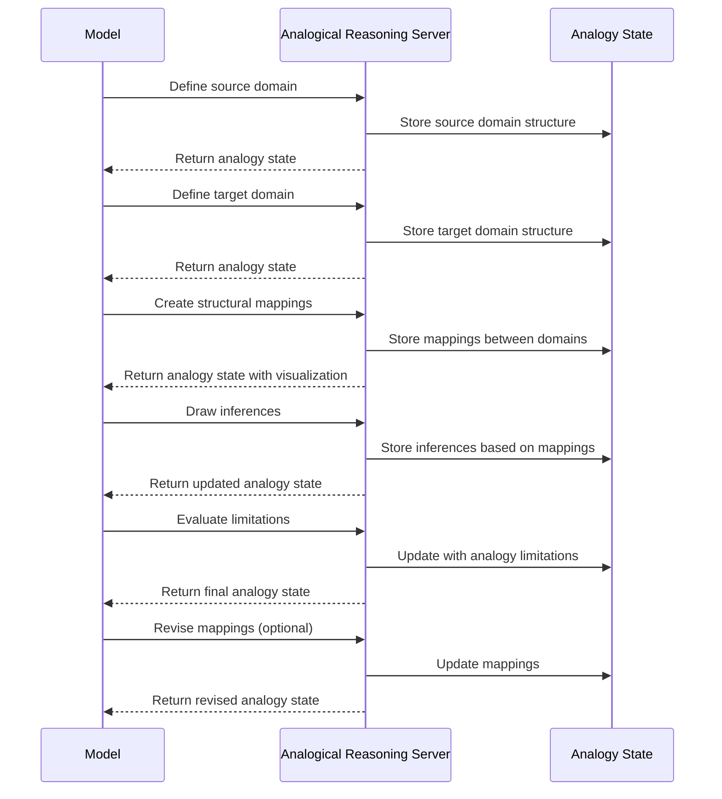

# Analogical Reasoning MCP Server

## Motivation

Analogical thinking is a powerful cognitive tool that humans use to understand new concepts by relating them to familiar ones. While language models can use analogies, they often:

1. Apply analogies inconsistently or abandon them partway through analysis
2. Fail to explicitly map structural relationships between source and target domains
3. Overextend analogies beyond their useful boundaries
4. Miss opportunities to leverage analogical transfer for problem-solving
5. Struggle to evaluate the quality and limitations of different analogies

The Analogical Reasoning Server addresses these limitations by providing a structured framework for constructing, mapping, and evaluating analogies. By externalizing analogical thinking, models can leverage this powerful cognitive tool more systematically and effectively.

## Technical Specification

### Tool Interface

```typescript
interface DomainElement {
  id: string;
  name: string;
  type: "entity" | "attribute" | "relation" | "process";
  description: string;
}

interface AnalogicalMapping {
  sourceElement: string; // ID of source domain element
  targetElement: string; // ID of target domain element
  mappingStrength: number; // 0.0-1.0
  justification: string;
  limitations?: string[];
}

interface AnalogicalReasoningData {
  // Core analogy components
  sourceDoamin: {
    name: string;
    elements: DomainElement[];
  };
  targetDomain: {
    name: string;
    elements: DomainElement[];
  };
  mappings: AnalogicalMapping[];
  
  // Analogy metadata
  analogyId: string;
  purpose: "explanation" | "prediction" | "problem-solving" | "creative-generation";
  confidence: number; // 0.0-1.0
  iteration: number;
  
  // Evaluation
  strengths: string[];
  limitations: string[];
  inferences: Array<{
    statement: string;
    confidence: number;
    basedOnMappings: string[]; // IDs of mappings supporting this inference
  }>;
  
  // Next steps
  nextOperationNeeded: boolean;
  suggestedOperations?: Array<"add-mapping" | "revise-mapping" | "draw-inference" | "evaluate-limitation" | "try-new-source">;
}
```

### Server Implementation

The server maintains:

1. An `analogyHistory` array containing all analogies and their evolution
2. A `domainRegistry` storing frequently used source domains and their elements
3. Visualization logic for displaying analogical mappings

For each analogical reasoning operation, the server:

1. Validates the operation according to analogical reasoning principles
2. Updates the appropriate analogy state
3. Visualizes the analogical mapping
4. Returns metadata about the analogy, including suggested next steps

### Process Flow



## Key Features

### 1. Explicit Domain Structuring

The server requires explicit structuring of both domains:
- **Entities**: Objects or concepts in each domain
- **Attributes**: Properties of those entities
- **Relations**: How entities relate to each other
- **Processes**: Dynamic interactions between entities

### 2. Structural Mapping

The server facilitates explicit mapping between domains:
- **Element-to-element**: Which elements correspond to each other
- **Relation-to-relation**: Preserving the structural relationships
- **Mapping strength**: Rating how well each mapping works
- **Justification**: Explanation for why the mapping is valid

### 3. Inference Generation

The server guides drawing inferences from the analogy:
- **Projection**: Transferring knowledge from source to target
- **Prediction**: Making predictions based on source domain patterns
- **Novel insights**: Identifying new perspectives on the target domain

### 4. Analogy Evaluation

Each analogy is systematically evaluated:
- **Strengths**: Where the analogy is particularly illuminating
- **Limitations**: Where the analogy breaks down
- **Confidence**: Overall assessment of analogy quality
- **Alternatives**: Considering different source domains

### 5. Visual Representation

The server provides visualization of the analogical mapping:
- Connection diagrams showing mappings between domains
- Color-coding for mapping strength
- Highlighting unmapped elements in both domains

## Usage Examples

### Complex Concept Explanation
When explaining complex technical concepts, the model can develop systematic analogies to more familiar domains, with explicit mappings and limitations.

### Problem Solving by Analogy
For novel problems, the model can map them to familiar solved problems and transfer solution strategies.

### Creative Ideation
When generating creative ideas, the model can systematically map concepts from distant domains to generate novel combinations.

### Scientific Modeling
For scientific concepts, the model can evaluate the strengths and limitations of different analogical models.

## Implementation Notes

The server would be implemented using TypeScript with:
- A core AnalogicalReasoningServer class
- Domain representation and visualization components
- Mapping quality evaluation algorithms
- Inference projection guidelines
- Standard MCP server connection via stdin/stdout

This server would enhance model capabilities in domains requiring creative problem-solving, explanation of complex concepts, and transfer of knowledge between different fields or contexts.