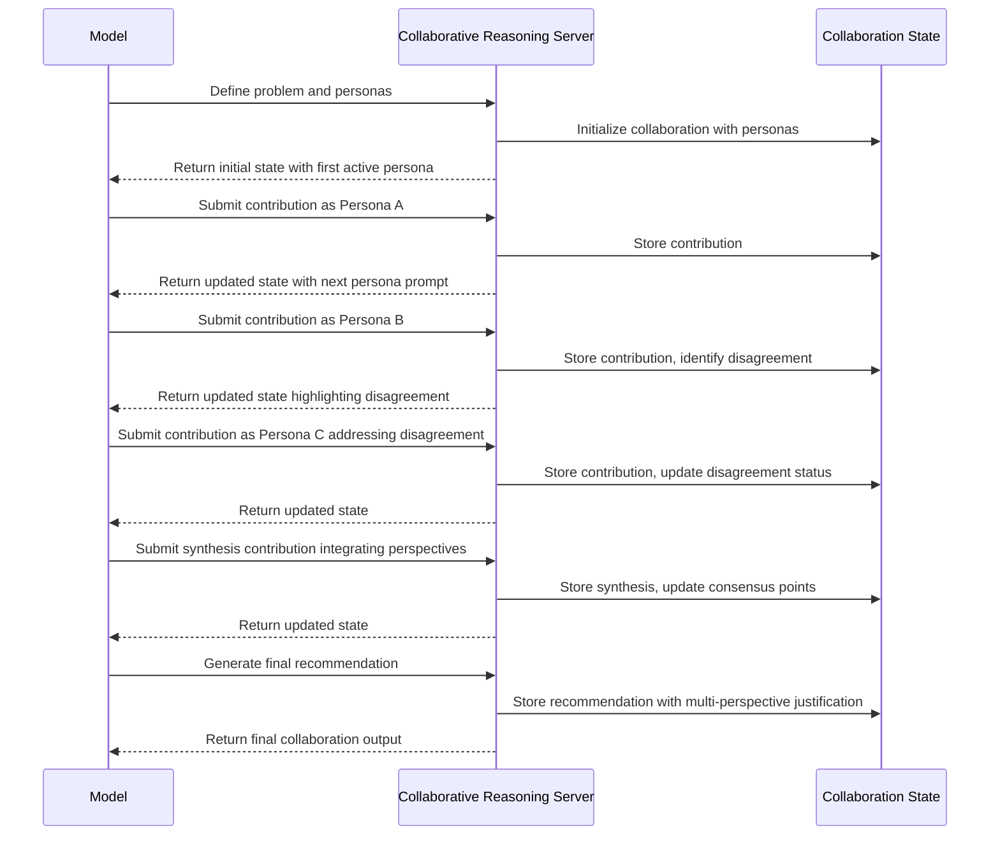

# Collaborative Reasoning MCP Server

## Motivation

Complex problems often benefit from diverse perspectives and expertise. While language models can attempt to simulate different viewpoints, they often:

1. Fail to maintain consistent, distinct perspectives throughout an analysis
2. Struggle to create genuine productive tension between viewpoints
3. Blend different expertise domains in unrealistic ways
4. Neglect to systematically integrate insights from different perspectives
5. Miss opportunities for creative synthesis that emerges from diverse thinking

The Collaborative Reasoning Server addresses these limitations by creating a structured environment for multiple simulated experts to collaborate on complex problems. By externalizing collaborative thinking, models can leverage diverse perspectives more systematically and effectively.

## Technical Specification

### Tool Interface

```typescript
interface Persona {
  id: string;
  name: string;
  expertise: string[];
  background: string;
  perspective: string;
  biases: string[];
  communication: {
    style: string;
    tone: string;
  };
}

interface Contribution {
  personaId: string;
  content: string;
  type: "observation" | "question" | "insight" | "concern" | "suggestion" | "challenge" | "synthesis";
  referencesIds?: string[]; // IDs of previous contributions this builds upon
  confidence: number; // 0.0-1.0
}

interface Disagreement {
  topic: string;
  positions: Array<{
    personaId: string;
    position: string;
    arguments: string[];
  }>;
  resolution?: {
    type: "consensus" | "compromise" | "integration" | "tabled";
    description: string;
  };
}

interface CollaborativeReasoningData {
  // Core collaboration components
  topic: string;
  personas: Persona[];
  contributions: Contribution[];
  disagreements?: Disagreement[];
  
  // Process structure
  stage: "problem-definition" | "ideation" | "critique" | "integration" | "decision" | "reflection";
  activePersonaId: string;
  nextPersonaId?: string;
  
  // Collaboration output
  keyInsights?: string[];
  consensusPoints?: string[];
  openQuestions?: string[];
  finalRecommendation?: string;
  
  // Process metadata
  sessionId: string;
  iteration: number;
  
  // Next steps
  nextContributionNeeded: boolean;
  suggestedContributionTypes?: string[];
}
```

### Server Implementation

The server maintains:

1. A `personaRegistry` storing defined expert personas
2. A `contributionHistory` tracking all interactions
3. A `disagreementTracker` for documenting and resolving conflicts
4. Facilitation logic to manage collaboration flow

For each collaborative reasoning operation, the server:

1. Validates the contribution against the active persona
2. Updates the collaboration state
3. Manages persona transitions and facilitation
4. Returns the updated state with suggested next steps

### Process Flow



## Key Features

### 1. Multi-Persona Simulation

The server enables creation and management of diverse personas:
- **Expertise profiles**: Defined knowledge domains
- **Perspectives**: Unique viewpoints and priorities
- **Communication styles**: Consistent voice for each persona
- **Explicit biases**: Acknowledged limitations in each perspective

### 2. Structured Collaboration Process

The server guides a systematic collaborative process:
- **Problem definition**: Framing the challenge from multiple perspectives
- **Ideation**: Generating diverse approaches
- **Critique**: Systematic evaluation from different viewpoints
- **Integration**: Synthesizing insights across perspectives
- **Decision**: Reaching reasoned conclusions

### 3. Disagreement Management

The server provides mechanisms for productive disagreement:
- **Disagreement tracking**: Explicitly documenting differing views
- **Position mapping**: Clarifying where perspectives diverge
- **Resolution strategies**: Methods for handling disagreements
- **Structured debate**: Focused exploration of key differences

### 4. Cross-Pollination Tracking

The server tracks how ideas evolve across personas:
- **Reference links**: How contributions build on each other
- **Insight evolution**: Tracing how ideas transform
- **Integration patterns**: How diverse inputs combine

### 5. Visual Representation

The server visualizes the collaborative process:
- Contribution networks showing idea evolution
- Perspective maps highlighting agreements and disagreements
- Synthesis visualizations showing integrated insights

## Usage Examples

### Complex Problem Solving
For multifaceted problems, the model can simulate perspectives from different domains (technical, ethical, business, legal) to develop comprehensive solutions.

### Product Design
When designing products, the model can incorporate perspectives of engineers, designers, marketers, and users to identify optimal approaches.

### Strategic Planning
For organizational strategy, the model can simulate perspectives of different stakeholders and departments to create more robust plans.

### Ethical Dilemma Analysis
When analyzing ethical questions, the model can represent diverse philosophical, cultural, and stakeholder perspectives.

## Implementation Notes

The server would be implemented using TypeScript with:
- A core CollaborativeReasoningServer class
- Persona management system
- Contribution and disagreement tracking
- Facilitation algorithms to guide productive collaboration
- Standard MCP server connection via stdin/stdout

This server would enhance model capabilities for complex problems requiring diverse expertise and perspectives, allowing for more thorough exploration of solution spaces and more robust final recommendations.