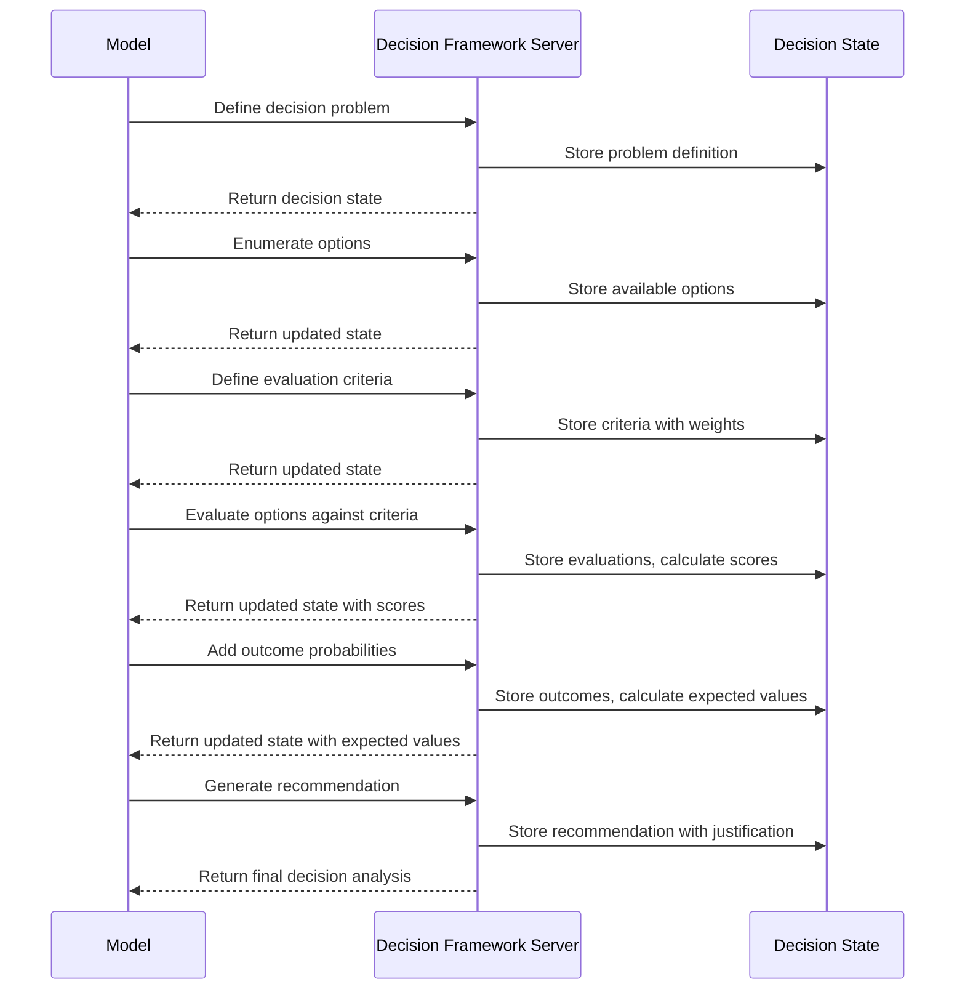

# Decision Framework MCP Server

[](https://smithery.ai/server/@waldzellai/decision-framework)

## Motivation

Language models often struggle with structured decision-making, particularly when multiple options, uncertain outcomes, and complex value trade-offs are involved. Current models frequently:

1. Fail to systematically enumerate all available options
2. Make inconsistent judgments about outcome probabilities
3. Conflate preference and probability in evaluating options
4. Do not systematically identify and weigh decision criteria
5. Neglect to account for risk tolerance in recommendations
6. Miss opportunities for gathering additional information

The Decision Framework Server addresses these limitations by providing a structured framework for decision analysis. By externalizing the decision-making process, models can provide more rigorous, transparent, and personalized decision support.

## Technical Specification

### Tool Interface

```typescript
interface Option {
  id: string;
  name: string;
  description: string;
}

interface Outcome {
  id: string;
  description: string;
  probability: number; // 0.0-1.0
  optionId: string;
  value: number; // Utility value, can be positive or negative
  confidenceInEstimate: number; // 0.0-1.0
}

interface Criterion {
  id: string;
  name: string;
  description: string;
  weight: number; // 0.0-1.0, with all weights summing to 1.0
  evaluationMethod: "quantitative" | "qualitative" | "boolean";
}

interface CriterionEvaluation {
  criterionId: string;
  optionId: string;
  score: number; // 0.0-1.0 for normalized scores
  justification: string;
}

interface InformationGap {
  description: string;
  impact: number; // 0.0-1.0, how much it affects the decision
  researchMethod: string;
}

interface DecisionAnalysisData {
  // Core decision elements
  decisionStatement: string;
  options: Option[];
  criteria?: Criterion[];
  criteriaEvaluations?: CriterionEvaluation[];
  possibleOutcomes?: Outcome[];
  informationGaps?: InformationGap[];
  
  // Decision context
  stakeholders: string[];
  constraints: string[];
  timeHorizon: string;
  riskTolerance: "risk-averse" | "risk-neutral" | "risk-seeking";
  
  // Analysis results
  expectedValues?: Record<string, number>; // optionId -> expected value
  multiCriteriaScores?: Record<string, number>; // optionId -> weighted score
  sensitivityInsights?: string[];
  recommendation?: string;
  
  // Process metadata
  decisionId: string;
  analysisType: "expected-utility" | "multi-criteria" | "maximin" | "minimax-regret" | "satisficing";
  stage: "problem-definition" | "options" | "criteria" | "evaluation" | "analysis" | "recommendation";
  iteration: number;
  
  // Next steps
  nextStageNeeded: boolean;
  suggestedNextStage?: string;
}
```

### Process Flow



## Key Features

### 1. Structured Decision Formulation

The server enforces clear problem definition:
- **Decision statement**: Explicit framing of the decision
- **Options**: Comprehensive enumeration of alternatives
- **Constraints**: Explicit boundaries on viable options
- **Stakeholders**: Who is affected by the decision

### 2. Multi-Method Decision Analysis

The server supports various decision frameworks:
- **Expected Utility**: Probability � value calculations
- **Multi-Criteria Analysis**: Weighted scoring across criteria
- **Maximin/Maximax**: Focus on worst/best possible outcomes
- **Minimax Regret**: Minimizing maximum potential regret
- **Satisficing**: Finding options that meet minimum thresholds

### 3. Probability and Value Separation

The server maintains clear distinction between:
- **Probability assessments**: Likelihood of outcomes
- **Value judgments**: Desirability of outcomes
- **Confidence levels**: Certainty of estimates

### 4. Information Value Analysis

The server identifies:
- **Information gaps**: What we don't know
- **Research value**: Worth of gathering more information
- **Decision robustness**: How sensitive recommendations are to assumptions

### 5. Visual Representation

The server visualizes decision analysis:
- Decision trees for expected utility analysis
- Heat maps for multi-criteria analysis
- Sensitivity graphs showing how changes affect recommendations

## Usage Examples

### Personal Decision Support
For major life decisions (career, education, relocation), the model can structure options, criteria, and uncertainties to provide personalized guidance.

### Business Strategy
When evaluating business initiatives, the model can analyze options across multiple criteria with explicit weighting of factors.

### Risk Management
For decisions with significant uncertainties, the model can provide expected value calculations with confidence intervals.

### Policy Analysis
When evaluating policy options, the model can systematically account for impacts across different stakeholders.

## Implementation

### Installing via Smithery

To install Decision Framework Server for Claude Desktop automatically via [Smithery](https://smithery.ai/server/@waldzellai/decision-framework):

```bash
npx -y @smithery/cli install @waldzellai/decision-framework --client claude
```

The server is implemented using TypeScript with:
- A core DecisionFrameworkServer class
- Decision analysis calculation engines
- Visualization components for different analysis types
- Sensitivity analysis utilities
- Standard MCP server connection via stdin/stdout

This server enhances model capabilities for complex decision support, particularly in domains requiring systematic comparison of options, explicit trade-off analysis, and structured handling of uncertainty.
