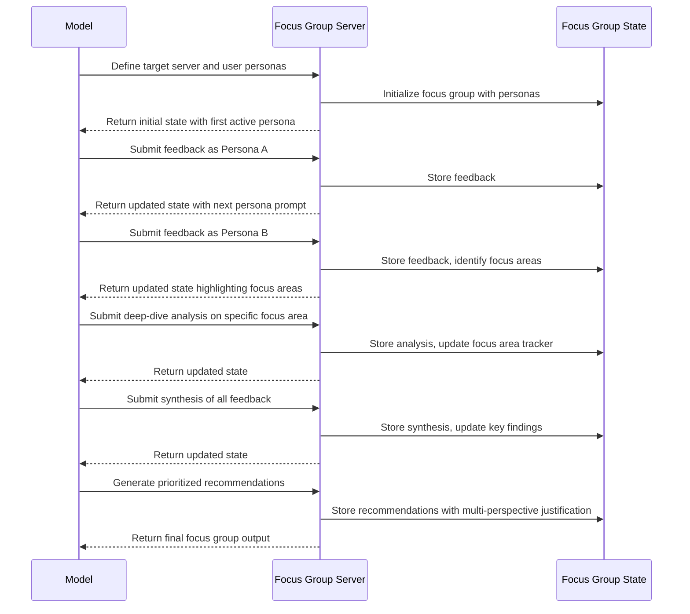

# Focus Group MCP Server

## Motivation

When developing MCP servers for use by large language models (LLMs), it can be challenging to anticipate how different types of LLM users might interact with, perceive, and experience your server. While developers may have a clear understanding of their API design, actual LLM users might:

1. Find the server's API confusing or unintuitive
2. Miss opportunities for more effective interaction patterns
3. Experience usability issues that weren't apparent during development
4. Have needs that weren't considered in the original design
5. Use the server in ways the developers hadn't anticipated

The Focus Group Server addresses these challenges by creating a structured environment for simulating multiple LLM user personas to evaluate and critique MCP servers. By externalizing the evaluation process, models can systematically analyze servers from diverse user perspectives and provide structured, actionable feedback.

## Technical Specification

### Tool Interface

```typescript
interface FocusGroupPersona {
  id: string;
  name: string;
  userType: string; // e.g., novice, expert, enterprise, developer
  usageScenario: string; // typical use case scenario
  expectations: string[];
  priorities: string[];
  constraints: string[];
  communication: {
    style: string;
    tone: string;
  };
}

interface Feedback {
  personaId: string;
  content: string;
  type: "praise" | "confusion" | "suggestion" | "usability" | "feature" | "bug" | "summary";
  targetComponent?: string; // which aspect of the server this feedback relates to
  severity: number; // 0.0-1.0, how important this feedback is
  referenceIds?: string[]; // IDs of previous feedback this builds upon
}

interface FocusAreaAnalysis {
  area: string; // e.g., "API Design", "Documentation", "Error Handling"
  findings: Array<{
    personaId: string;
    finding: string;
    impact: string;
    suggestion?: string;
  }>;
  resolution?: {
    type: "implemented" | "considered" | "rejected" | "deferred";
    description: string;
  };
}

interface FocusGroupData {
  // Core focus group components
  targetServer: string; // The MCP server being analyzed
  personas: FocusGroupPersona[];
  feedback: Feedback[];
  focusAreaAnalyses?: FocusAreaAnalysis[];
  
  // Process structure
  stage: "introduction" | "initial-impressions" | "deep-dive" | "synthesis" | "recommendations" | "prioritization";
  activePersonaId: string;
  nextPersonaId?: string;
  
  // Analysis output
  keyStrengths?: string[];
  keyWeaknesses?: string[];
  topRecommendations?: string[];
  unanimousPoints?: string[];
  
  // Process metadata
  sessionId: string;
  iteration: number;
  
  // Next steps
  nextFeedbackNeeded: boolean;
  suggestedFeedbackTypes?: string[];
  suggestedFocusArea?: string;
}
```

### Server Implementation

The server maintains:

1. A `personaRegistry` storing defined LLM user personas
2. A `feedbackHistory` tracking all feedback across sessions
3. A `focusAreaTracker` for documenting focused analyses of server aspects
4. Facilitation logic to manage the focus group process

For each focus group operation, the server:

1. Validates the input data structure
2. Updates the focus group state
3. Manages persona transitions and facilitation
4. Returns the updated state with suggested next steps

### Process Flow



## Key Features

### 1. Multi-Persona Simulation

The server enables creation and management of diverse LLM user personas:
- **User types**: Different LLM user profiles (novice, expert, enterprise, developer)
- **Usage scenarios**: Typical use cases for each user type
- **Expectations and priorities**: What each user type values most
- **Constraints**: Limitations each user type operates under
- **Communication styles**: Consistent voice for each persona

### 2. Structured Evaluation Process

The server guides a systematic evaluation process:
- **Introduction**: Framing the server's purpose and target audience
- **Initial impressions**: First reactions from different user types
- **Deep-dive**: Detailed exploration of specific aspects
- **Synthesis**: Integrating diverse feedback
- **Recommendations**: Generating actionable improvements
- **Prioritization**: Ranking recommendations by impact and effort

### 3. Focus Area Analysis

The server provides mechanisms for targeted evaluation:
- **Focus area tracking**: Explicitly documenting server aspects needing attention
- **Impact assessment**: Evaluating how issues affect different user types
- **Resolution tracking**: Methods for addressing identified issues
- **Suggestion management**: Tracking improvement ideas

### 4. Feedback Categorization

The server classifies feedback to make it more actionable:
- **Praise**: Positive aspects worth preserving or expanding
- **Confusion**: Areas that are unclear or counterintuitive
- **Suggestion**: Ideas for improvements
- **Usability**: How the server feels to use
- **Feature**: New capabilities to consider
- **Bug**: Problems that need fixing
- **Summary**: High-level observations

### 5. Visual Representation

The server visualizes the focus group process:
- Persona profiles showing diverse user perspectives
- Feedback streams showing reactions by feedback type
- Focus area analyses highlighting priorities
- Strength/weakness assessments showing consensus views

## Usage Examples

### New Server Evaluation
When developing a new MCP server, use the focus group server to simulate how different LLM users would experience your API design and functionality.

### Server Refinement
For existing servers, use the focus group server to identify pain points and opportunities for improvement across different user types.

### Competitive Analysis
Compare multiple server approaches by running separate focus groups and analyzing which designs work best for which user types.

### Documentation Improvement
Identify gaps in documentation by examining where confusion arises among different user personas.

## Implementation Notes

The server is implemented using TypeScript with:
- A core FocusGroupServer class
- Persona management system
- Feedback and focus area tracking
- Visualization capabilities for the evaluation process
- Standard MCP server connection via stdin/stdout

This server enhances the development process for MCP servers by providing diverse user perspectives, structured feedback, and actionable recommendations, allowing for more user-centered design and improved usability.

## Example Persona Types

Here are some example persona types to consider including in your focus groups:

1. **Novice LLM**: New to using tools, learning how to integrate external capabilities
2. **Expert LLM**: Sophisticated in tool use, needs efficient APIs
3. **Enterprise LLM**: Concerned with security, reliability, and scale
4. **Developer-focused LLM**: Building applications integrating with tools
5. **Specialized-domain LLM**: Focused on specific industry needs
6. **Multi-step Reasoning LLM**: Needs tools that support complex workflows
7. **Educational LLM**: Using tools to enhance learning experiences
8. **Creative LLM**: Focused on tools for creative tasks

## Recommended Focus Areas

Common focus areas to analyze for MCP servers:

1. **API Design**: Clarity, consistency, and intuitiveness of the API
2. **Documentation**: Completeness, clarity, and helpfulness
3. **Error Handling**: Quality of error messages and recovery options
4. **Performance**: Speed and efficiency of operations
5. **Flexibility**: Adaptability to different use cases
6. **Integration**: Ease of incorporating into workflows
7. **Input/Output Format**: Clarity and usefulness of data formats
8. **Feedback Mechanisms**: How the server communicates its state and results