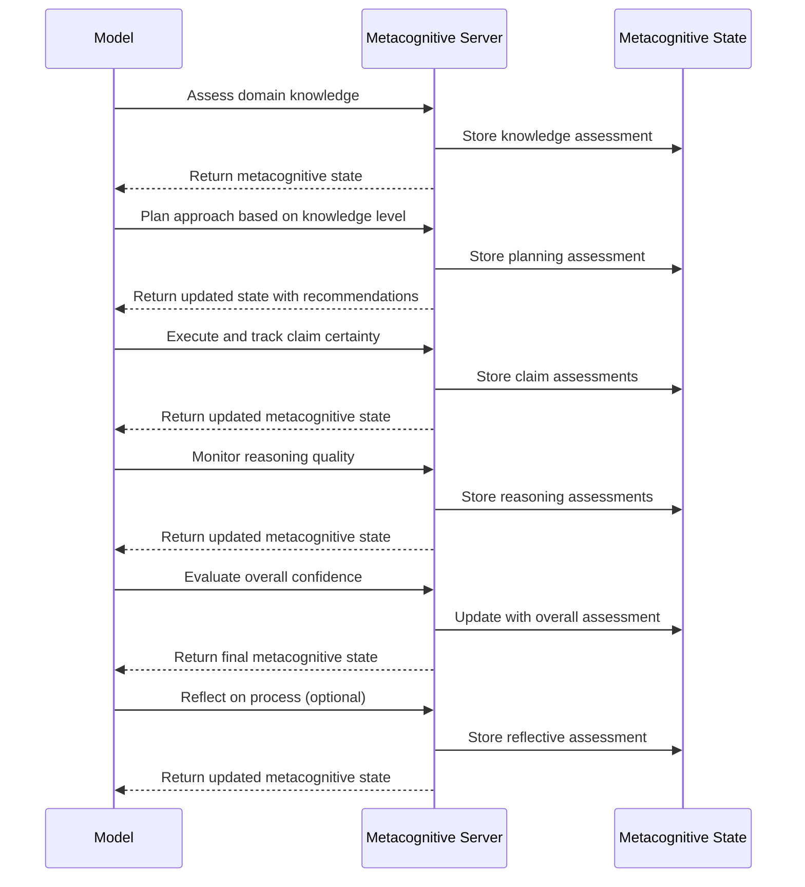

# Metacognitive Monitoring MCP Server

## Motivation

Language models often struggle with metacognition - the ability to accurately monitor and evaluate their own knowledge, reasoning processes, and confidence. Current models frequently:

1. Express overconfidence in domains where they have limited knowledge
2. Fail to explicitly track reasoning quality across complex chains of thought
3. Do not systematically identify potential biases in their reasoning
4. Struggle to distinguish between facts, inferences, and speculation
5. Lack awareness of when they're operating outside their knowledge boundaries

The Metacognitive Monitoring Server addresses these limitations by providing a structured framework for models to evaluate their own cognitive processes. By externalizing metacognition, models can achieve greater accuracy, reliability, and transparency in their reasoning.

## Technical Specification

### Tool Interface

```typescript
interface KnowledgeAssessment {
  domain: string;
  knowledgeLevel: "expert" | "proficient" | "familiar" | "basic" | "minimal" | "none";
  confidenceScore: number; // 0.0-1.0
  supportingEvidence: string;
  knownLimitations: string[];
  relevantTrainingCutoff?: string; // e.g., "2021-09"
}

interface ClaimAssessment {
  claim: string;
  status: "fact" | "inference" | "speculation" | "uncertain";
  confidenceScore: number; // 0.0-1.0
  evidenceBasis: string;
  alternativeInterpretations?: string[];
  falsifiabilityCriteria?: string;
}

interface ReasoningAssessment {
  step: string;
  potentialBiases: string[];
  assumptions: string[];
  logicalValidity: number; // 0.0-1.0
  inferenceStrength: number; // 0.0-1.0
}

interface MetacognitiveMonitoringData {
  // Current focus
  task: string;
  stage: "knowledge-assessment" | "planning" | "execution" | "monitoring" | "evaluation" | "reflection";
  
  // Assessments
  knowledgeAssessment?: KnowledgeAssessment;
  claims?: ClaimAssessment[];
  reasoningSteps?: ReasoningAssessment[];
  
  // Overall evaluation
  overallConfidence: number; // 0.0-1.0
  uncertaintyAreas: string[];
  recommendedApproach: string;
  
  // Monitoring metadata
  monitoringId: string;
  iteration: number;
  
  // Next steps
  nextAssessmentNeeded: boolean;
  suggestedAssessments?: Array<"knowledge" | "claim" | "reasoning" | "overall">;
}
```

### Process Flow



## Key Features

### 1. Knowledge Boundary Tracking

The server enforces explicit assessment of knowledge:
- **Domain expertise**: Self-rating knowledge level in relevant domains
- **Evidence basis**: Justification for claimed knowledge
- **Known limitations**: Explicit boundaries of knowledge
- **Training relevance**: Awareness of potential training data limitations

### 2. Claim Classification

Claims must be explicitly categorized:
- **Facts**: Information the model has high confidence in
- **Inferences**: Reasonable conclusions from facts
- **Speculations**: Possibilities with limited evidence
- **Uncertainties**: Areas where knowledge is insufficient

### 3. Reasoning Quality Monitoring

The server tracks reasoning process quality:
- **Potential biases**: Self-monitoring for cognitive biases
- **Hidden assumptions**: Surfacing implicit assumptions
- **Logical validity**: Assessing deductive reasoning quality
- **Inference strength**: Evaluating inductive/abductive reasoning

### 4. Uncertainty Management

The server provides tools for handling uncertainty:
- **Confidence calibration**: Explicit confidence scoring
- **Uncertainty areas**: Identified gaps in knowledge or reasoning
- **Alternative interpretations**: Tracking multiple possible views
- **Falsifiability**: Criteria that would prove claims wrong

### 5. Visual Representation

The server visualizes metacognitive state:
- Confidence heat maps for different claims
- Knowledge boundary diagrams
- Reasoning quality evaluations with identified weak points

## Usage Examples

### Technical Advising
When providing technical recommendations, the model can accurately represent its confidence in different aspects and highlight areas that require external verification.

### Scientific Analysis
For analyzing scientific claims, the model can distinguish between established facts and inferences, with appropriate confidence calibration.

### Decision Support
When supporting decisions with uncertain information, the model can provide transparent confidence assessments and identify critical knowledge gaps.

### Educational Content
For explaining complex topics, the model can accurately represent its knowledge boundaries and distinguish between consensus views and areas of debate.

## Implementation

The server is implemented using TypeScript with:
- A core MetacognitiveMonitoringServer class
- Knowledge and confidence tracking components
- Bias detection algorithms
- Confidence calibration utilities
- Standard MCP server connection via stdin/stdout

This server enhances model reliability in domains requiring careful distinction between facts and speculations, accurate confidence assessment, and awareness of knowledge limitations.