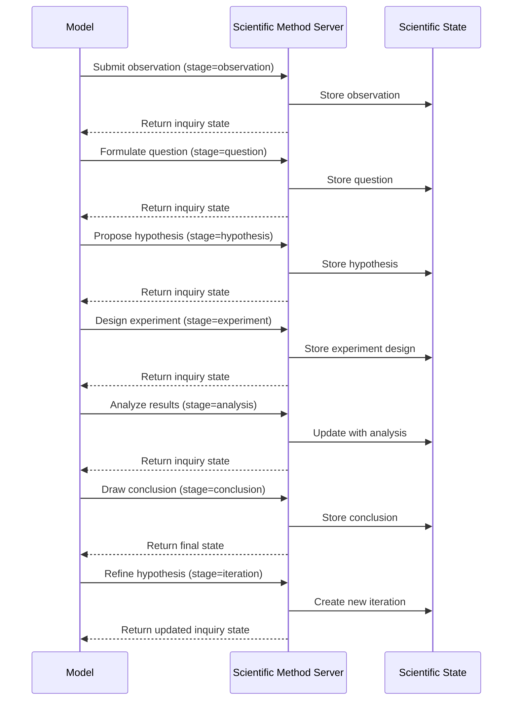

# Scientific Method MCP Server

[](https://smithery.ai/server/@waldzellai/scientific-method)

## Motivation

Language models often struggle with applying rigorous scientific reasoning. While they can describe the scientific method, they frequently:

1. Jump to conclusions without systematic hypothesis testing
2. Fail to explicitly identify assumptions underlying their reasoning
3. Conflate correlation with causation in explanatory claims
4. Neglect alternative explanations for observed phenomena
5. Show inconsistency in evaluating evidence across different hypotheses
6. Make predictions without clear falsifiability criteria

The Scientific Method Server addresses these limitations by providing an external framework that guides models through formal scientific reasoning processes. By externalizing the scientific method, models can engage in more rigorous, transparent, and self-correcting inquiry.

## Technical Specification

### Tool Interface

```typescript
interface HypothesisData {
  // Core hypothesis components
  statement: string;
  variables: Array<{
    name: string;
    type: "independent" | "dependent" | "controlled" | "confounding";
    operationalization?: string;
  }>;
  assumptions: string[];
  
  // Hypothesis metadata
  hypothesisId: string;
  confidence: number; // 0.0-1.0
  domain: string;
  iteration: number;
  
  // Relationships
  alternativeTo?: string[]; // IDs of competing hypotheses
  refinementOf?: string; // ID of parent hypothesis
  
  // Current status
  status: "proposed" | "testing" | "supported" | "refuted" | "refined";
}

interface ExperimentData {
  // Core experiment components
  design: string;
  methodology: string;
  predictions: Array<{
    if: string;
    then: string;
    else?: string;
  }>;
  
  // Experiment metadata
  experimentId: string;
  hypothesisId: string;
  controlMeasures: string[];
  
  // Results (if conducted)
  results?: string;
  outcomeMatched?: boolean;
  unexpectedObservations?: string[];
  
  // Evaluation
  limitations?: string[];
  nextSteps?: string[];
}

interface ScientificInquiryData {
  // Process stage
  stage: "observation" | "question" | "hypothesis" | "experiment" | "analysis" | "conclusion" | "iteration";
  
  // Content for current stage
  observation?: string;
  question?: string;
  hypothesis?: HypothesisData;
  experiment?: ExperimentData;
  analysis?: string;
  conclusion?: string;
  
  // Process metadata
  inquiryId: string;
  iteration: number;
  
  // Next steps
  nextStageNeeded: boolean;
}
```

### Process Flow



## Key Features

### 1. Structured Scientific Process

The server enforces a structured scientific inquiry process:
- **Observation**: Making and recording observations about phenomena
- **Question**: Formulating specific, testable questions
- **Hypothesis**: Creating falsifiable hypotheses with variables
- **Experiment**: Designing controlled tests with predictions
- **Analysis**: Evaluating results against predictions
- **Conclusion**: Drawing warranted conclusions
- **Iteration**: Refining hypotheses based on results

### 2. Hypothesis Management

Hypotheses must be explicitly formulated with:
- **Statement**: Clear, testable proposition
- **Variables**: Identified and categorized (independent, dependent, etc.)
- **Assumptions**: Explicit underlying assumptions
- **Alternatives**: Competing explanations for same phenomena

### 3. Experimental Design

The server guides rigorous experimental design:
- **Methodology**: Clear procedural steps
- **Predictions**: Explicit if-then statements for expected outcomes
- **Controls**: Measures to eliminate confounding variables
- **Limitations**: Acknowledged constraints of the design

### 4. Evidence Evaluation

Evidence is systematically evaluated:
- **Confirmatory**: Evidence supporting hypotheses
- **Disconfirmatory**: Evidence challenging hypotheses
- **Unexpected**: Observations not predicted by hypotheses

### 5. Iteration Tracking

The server tracks how scientific understanding evolves:
- History of hypothesis refinements
- Changing confidence levels based on evidence
- Alternative explanations explored and rejected

## Usage Examples

### Causal Analysis
When attempting to determine cause-effect relationships, the model can systematically work through alternative explanations and evidence evaluation.

### Technical Troubleshooting
For diagnosing problems, the model can generate competing hypotheses about failure causes and design tests to differentiate between them.

### Literature Review
When synthesizing research findings, the model can systematically evaluate evidence quality and competing explanations.

### Health Diagnosis
For medical reasoning, the model can track hypothesis confidence for different conditions based on symptoms and test results.

## Implementation

The server is implemented using TypeScript with:
- A core ScientificMethodServer class
- JSON schema validation for scientific process structures
- Visualization for the scientific inquiry process
- Relationship tracking between hypotheses and evidence
- Standard MCP server connection via stdin/stdout

This server provides significant enhancement to model reasoning in domains requiring causal analysis, hypothesis testing, and evidence evaluation - essentially any context where rigorous scientific thinking would benefit human reasoning as well.

### Installing via Smithery

To install Scientific Method Server for Claude Desktop automatically via [Smithery](https://smithery.ai/server/@waldzellai/scientific-method):

```bash
npx -y @smithery/cli install @waldzellai/scientific-method --client claude
```
