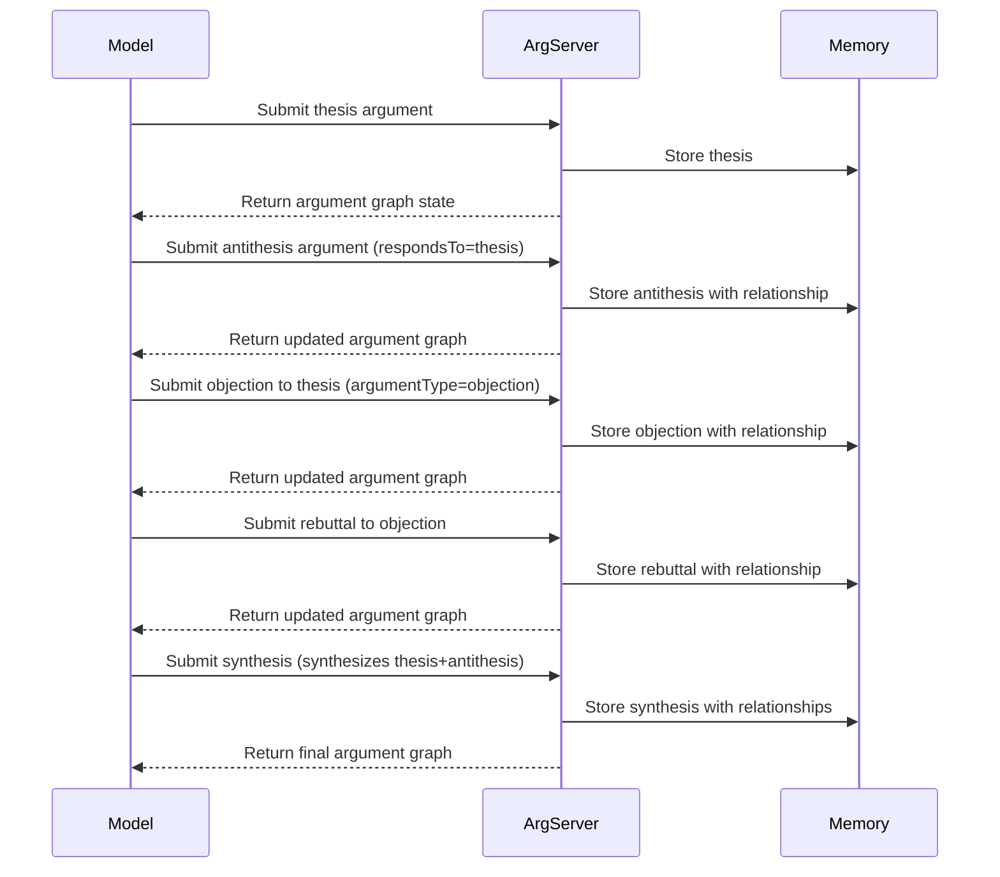

# Structured Argumentation MCP Server

## Motivation

Modern LLMs struggle with rigorously evaluating competing ideas, particularly when complex trade-offs, multiple stakeholders, or value tensions are involved. While models can generate arguments in both directions, they often:

1. Fail to thoroughly explore counterarguments to positions they initially favor
2. Struggle to maintain consistent evaluation criteria across different arguments
3. Prematurely converge on a position without adequate consideration of alternatives
4. Mix descriptive claims with normative judgments in unclear ways
5. Lose track of key points in complex, multi-step argumentation

The Structured Argumentation Server addresses these limitations by providing a formalized dialectical framework that models can use to systematically develop, critique, and synthesize arguments. By externalizing the argumentation process, models can engage in more rigorous, transparent, and balanced reasoning.

## Technical Specification

### Tool Interface

```typescript
interface ArgumentData {
  // Core argument components
  claim: string;
  premises: string[];
  conclusion: string;
  
  // Argument metadata
  argumentId: string;
  argumentType: "thesis" | "antithesis" | "synthesis" | "objection" | "rebuttal";
  confidence: number; // 0.0-1.0
  
  // Relationship to other arguments
  respondsTo?: string; // ID of argument this responds to
  supports?: string[]; // IDs of arguments this supports
  contradicts?: string[]; // IDs of arguments this contradicts
  
  // Evaluation
  strengths?: string[];
  weaknesses?: string[];
  
  // Next steps
  nextArgumentNeeded: boolean;
  suggestedNextTypes?: ("objection" | "rebuttal" | "synthesis")[];
}
```

### Process Flow



## Key Features

### 1. Explicit Argumentation Structures

Arguments must be broken down into discrete components:
- **Claim**: The central proposition being argued
- **Premises**: Supporting evidence or assumptions
- **Conclusion**: The logical consequence of accepting the claim

### 2. Dialectical Progression

The server enforces a dialectical structure:
- **Thesis**: Initial argument
- **Antithesis**: Counter-argument
- **Synthesis**: Resolution of thesis and antithesis
- **Objections**: Challenges to specific premises or reasoning
- **Rebuttals**: Responses to objections

### 3. Relationship Tracking

Arguments are explicitly connected to show:
- Which arguments support others
- Which arguments contradict others
- Which arguments synthesize others

### 4. Argument Evaluation

Each argument can be evaluated through:
- **Strengths**: Particularly compelling aspects
- **Weaknesses**: Vulnerable assumptions or logic
- **Confidence**: Model's estimate of argument validity

### 5. Visual Representation

The server outputs a formatted, color-coded representation of the argument structure, making the dialectical process visually trackable.

## Usage Examples

### Ethical Dilemma Analysis
For complex ethical questions, the model can develop comprehensive pro/con analyses with multiple levels of objections and rebuttals.

### Policy Evaluation
When evaluating policy options, the model can systematically explore benefits and drawbacks for different stakeholders, account for objections, and reach nuanced conclusions.

### Scientific Hypothesis Evaluation
For evaluating competing scientific explanations, the model can map out evidence supporting each theory and methodically address counterarguments.

## Implementation

The server is implemented using TypeScript with:
- A core ArgumentationServer class
- JSON schema validation for argument structure
- A graph data structure for relationship tracking
- Visualization using ANSI color codes or ASCII diagrams
- Standard MCP server connection via stdin/stdout

This server significantly enhances model capabilities for complex reasoning tasks requiring careful weighing of competing considerations.

## Tool

### structuredArgumentation

Facilitates a detailed, dialectical argumentation process for rigorous reasoning.

## Configuration

### Usage with Claude Desktop

Add this to your `claude_desktop_config.json`:

#### npx

```json
{
  "mcpServers": {
    "structured-argumentation": {
      "command": "npx",
      "args": [
        "-y",
        "@waldzellai/structured-argumentation"
      ]
    }
  }
}
```

#### docker

```json
{
  "mcpServers": {
    "structured-argumentation": {
      "command": "docker",
      "args": [
        "run",
        "--rm",
        "-i",
        "waldzellai/structured-argumentation"
      ]
    }
  }
}
```

## Building

Docker:

```bash
docker build -t cognitive-enhancement-mcp/structured-argumentation -f packages/structured-argumentation/Dockerfile .
```

## License

This MCP server is licensed under the MIT License.