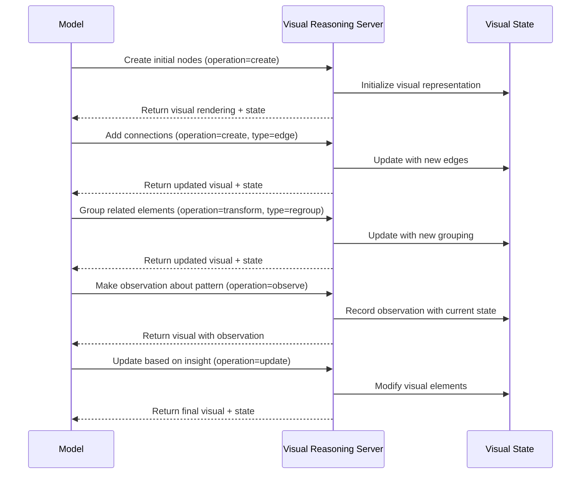

# Visual Reasoning MCP Server

## Motivation

Language models fundamentally operate on text, which limits their ability to reason through problems that humans typically solve using spatial, diagrammatic, or visual thinking. Current models struggle with:

1. Maintaining and manipulating complex spatial relationships
2. Visualizing multi-step transformations or processes
3. Creating and updating visual representations of abstract concepts
4. Reasoning about systems with many interconnected components
5. Identifying patterns that are obvious in visual form but obscure in text

The Visual Reasoning Server provides models with the ability to create, manipulate, and reason with explicit visual representations. By externalizing visual thinking, models can solve complex problems that benefit from diagrammatic reasoning, much like how mathematical notation extends human calculation abilities beyond plain text.

## Technical Specification

### Tool Interface

```typescript
interface VisualElement {
  id: string;
  type: "node" | "edge" | "container" | "annotation";
  label?: string;
  properties: {
    [key: string]: any; // Position, size, color, etc.
  };
  // For edges
  source?: string; // ID of source element
  target?: string; // ID of target element
  // For containers
  contains?: string[]; // IDs of contained elements
}

interface VisualOperationData {
  // Operation details
  operation: "create" | "update" | "delete" | "transform" | "observe";
  elements?: VisualElement[];
  transformationType?: "rotate" | "move" | "resize" | "recolor" | "regroup";
  
  // Visual diagram metadata
  diagramId: string;
  diagramType: "graph" | "flowchart" | "stateDiagram" | "conceptMap" | "treeDiagram" | "custom";
  iteration: number;
  
  // Reasoning about the diagram
  observation?: string;
  insight?: string;
  hypothesis?: string;
  
  // Next steps
  nextOperationNeeded: boolean;
}
```

### Process Flow



## Key Features

### 1. Multi-Modal Representation System

The server supports different visual representation types:
- **Graphs**: For relationship networks and connection patterns
- **Flowcharts**: For processes and sequential operations
- **State Diagrams**: For system states and transitions
- **Concept Maps**: For knowledge organization and relationships
- **Tree Diagrams**: For hierarchical structures

### 2. Abstract Visual Element Manipulation

Models can manipulate visual elements through operations:
- **Create**: Add new elements to the visual space
- **Update**: Modify existing elements
- **Delete**: Remove elements
- **Transform**: Apply operations to multiple elements (regrouping, restructuring)
- **Observe**: Make and record observations about visual patterns

### 3. Iterative Refinement

The server tracks iteration history, allowing models to:
- See how their visual representation evolved
- Revert to previous states if needed
- Compare different visualization approaches

### 4. Visual-Verbal Integration

The server enables bidirectional translation between:
- Verbal descriptions and visual representations
- Visual patterns and verbal insights
- Diagrammatic reasoning and textual conclusions

### 5. Visual Output

The server provides multiple representations:
- ASCII art for terminal-based visualization
- SVG or DOT format for more complex diagrams
- Textual descriptions of the visual state for accessibility

## Usage Examples

### System Architecture Design
Models can create and manipulate component diagrams showing data flow, dependencies, and interactions between system components.

### Algorithm Visualization
When designing or explaining algorithms, models can create flowcharts, state diagrams, or visual traces of execution.

### Concept Mapping
For organizing complex domains of knowledge, models can create and refine concept maps showing relationships between ideas.

### Pattern Recognition
When analyzing data, models can create visual representations to identify patterns that might be difficult to detect in text.

## Implementation

The server is implemented using TypeScript with:
- A core VisualReasoningServer class
- A flexible visual element representation system
- Multiple rendering backends (ASCII, SVG, DOT)
- State history tracking for iterative refinement
- Standard MCP server connection via stdin/stdout

The implementation leverages existing graph visualization libraries (like Graphviz for DOT output or custom ASCII art generation) to provide rich visual feedback within the constraints of text-based interfaces.

This server significantly enhances model capabilities for domains where visual or spatial thinking provides a natural advantage over purely textual reasoning.

## Tool

### visualReasoning

Facilitates visual thinking through creating and manipulating diagram elements.

## Configuration

### Usage with Claude Desktop

Add this to your `claude_desktop_config.json`:

#### npx

```json
{
  "mcpServers": {
    "visual-reasoning": {
      "command": "npx",
      "args": [
        "-y",
        "@waldzellai/visual-reasoning"
      ]
    }
  }
}
```

#### docker

```json
{
  "mcpServers": {
    "visual-reasoning": {
      "command": "docker",
      "args": [
        "run",
        "--rm",
        "-i",
        "cognitive-enhancement-mcp/visual-reasoning"
      ]
    }
  }
}
```

## Building

Docker:

```bash
docker build -t cognitive-enhancement-mcp/visual-reasoning -f packages/visual-reasoning/Dockerfile .
```

## License

This MCP server is licensed under the MIT License.